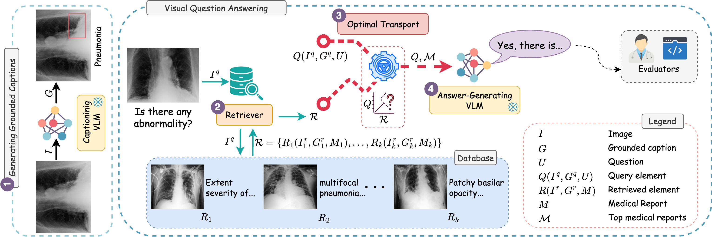

<br>
28th INTERNATIONAL CONFERENCE ON MEDICAL IMAGE COMPUTING AND COMPUTER ASSISTED INTERVENTION

# MOTOR: Multimodal Optimal Transport via Grounded Retrieval in Medical Visual Question Answering

Mai A. Shaaban [](https://orcid.org/0000-0003-1454-6090), Tausifa Jan Saleem [](https://orcid.org/0000-0002-0827-0043), Vijay Ram Papineni [](https://orcid.org/0000-0002-6162-3290), Mohammad Yaqub [](https://orcid.org/0000-0001-6896-1105)

 **Mohamed bin Zayed University of Artificial Intelligence, Abu Dhabi, UAE**

 **Sheikh Shakhbout Medical City, Abu Dhabi, UAE**

[](mailto:mai.shaaban.cs@gmail.com)
[](https://www.arxiv.org/abs/2506.22900)
[](https://www.python.org)
[](https://pytorch.org)

<hr>



<hr>

## :bulb: Highlights

* A novel training-free approach for retrieving precise contexts in a medical multimodal retrieval-augmented generation framework.
* A fine-grained visual-text alignment, which captures the underlying structures between the query and the retrieved elements, thereby improving clinical relevance. 
* Automated and human expert evaluations across vision language models and medical visual question answering datasets to demonstrate the strength of our proposed approach.

## :fire: News
- **`2025/06/25`**: Code is released!
- **`2025/06/17`**: Paper is accepted at MICCAI 2025 - The best conference for medical image computing!


## :hammer_and_wrench: Install  
* Clone this repository

  ```shell
  git clone https://github.com/Mai-CS/MOTOR.git
  cd MOTOR
  ```
  
* Install dependencies: (we assume GPU device / cuda available):
  
  ```shell
  source install.sh
  ```  

Now, you should be all set.

## :arrow_forward: Usage  

* Generate grounded reports

  ```shell
  cd models/
  python caption_maira.py --dataset_name "med-diff-vqa"
  ```

* Generate answers

  ```shell
  cd ..
  source run_MOTOR.sh
  ``` 

## :luggage: Models  

* [microsoft/maira-2](https://huggingface.co/microsoft/maira-2)

* [microsoft/llava-med-v1.5-mistral-7b](https://huggingface.co/microsoft/llava-med-v1.5-mistral-7b)

* [togethercomputer/Llama-3.1-8B-Dragonfly-Med-v2](https://huggingface.co/togethercomputer/Llama-3.1-8B-Dragonfly-Med-v2)

* [razent/SciFive-large-Pubmed_PMC-MedNLI](https://huggingface.co/razent/SciFive-large-Pubmed_PMC-MedNLI)


## :black_nib: Citation
```bibtex
@article{shaaban2025motor,
      title={MOTOR: Multimodal Optimal Transport via Grounded Retrieval in Medical Visual Question Answering}, 
      author={Mai A. Shaaban and Tausifa Jan Saleem and Vijay Ram Papineni and Mohammad Yaqub},
      year={2025},
      eprint={2506.22900},
      archivePrefix={arXiv},
      primaryClass={cs.CV},
      url={https://arxiv.org/abs/2506.22900}, 
}
```
